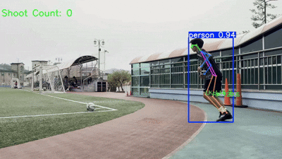

# ⚽ AI-Based Soccer Video Analysis and Performance Tracking

## 📝 1. Project Overview

This project utilizes deep learning and computer vision techniques to provide an automated solution for analyzing **player performance** from soccer videos. It is based on the **YOLO11 framework** for object detection, combined with the **DeepOcSort tracker** and **Pose Estimation** techniques, offering two core analysis functionalities.

| Analysis Module | Key Feature | Intended Purpose and Main Use Scenario |
| :--- | :--- | :--- |
| **Shot Counting** | Automatically **counts shooting attempts** by analyzing changes in player joint angles and the distance between the player and the ball. | The system helps measure training efficiency by automatically recording the number of attempts **when players practice corner kicks.** |
| **Player Tracking** | **Real-time trajectory tracking** and visualization of all player movements on the field. | Used for strategic planning and performance evaluation through analysis of individual player activity, positioning, and movement patterns during a match. |

## ✨ 2. Key Features

* **State-of-the-Art Technology:** Leverages **Ultralytics YOLO11** for high accuracy and fast inference speed.
* **Pose Analysis:** Uses YOLO Pose Estimation to precisely determine shooting actions based on changes in major joint angles.
* **Multi-Object Tracking (MOT):** Employs the **DeepOcSort** tracker with a Re-ID model to maintain stable object IDs and visualize movement paths.

## 📺 3. Demo and Results



## 🛠️ 4. Tech Stack

| Category | Technology / Model | Purpose |
| :--- | :--- | :--- |
| **Detection & Pose** | **Ultralytics YOLO11** (Base Model: `YOLO11x`) | Object Detection (Ball, Human), Pose Estimation |
| **Tracking** | **Boxmot** (`DeepOcSort`) | Multi-Object Tracking (MOT) Algorithm |
| **Re-Identification**| **OSNet** (`osnet_x0_25_msmt17.pt`) | Used for DeepOcSort's Re-ID functionality |
| **Language** | **Python** | Core Development Language |
| **Framework** | **PyTorch, OpenCV** | Deep Learning Backend and Video Processing |

---

## 🚀 5. Installation and Setup

### 5.1. Environment Setup and Library Installation

```bash
1. Install essential libraries (fixed versions)
ultralytics (v8.3.143 environment), boxmot (tracking), opencv installation
pip install ultralytics==8.3.143 boxmot==12.0.1 pip install opencv-python-headless==4.9.0.80 opencv-contrib-python==4.9.0.80

2. Force reinstall numpy to prevent version conflicts (especially on Colab)
pip install numpy==1.26.4 --force-reinstall
```
### 5.2. Model Weights

The following four weight files are required to run the project:
* `soccer_ball.pt` (Custom trained ball detection model)
* `yolo11x-pose.pt` (Pose estimation model)
* `yolo11x.pt` (General object detection model)
* `osnet_x0_25_msmt17.pt` (Re-ID model)

---

## 💻 6. How to Run

### A. Run Shot Counting

1.  **Input File:** Place the video file to be analyzed in the `soccer/soccer_input/` folder.
2.  **Execution:** Run the `soccer/shoot_count.ipynb` file.
3.  **Output:** The analyzed video is saved as `soccer/soccer_output/optimized_{input_file_name}.mp4`.

### B. Run Player Tracking

1.  **Input File:** Place the video file to be analyzed in the `soccer_tracking/soccer_input/` folder.
2.  **Execution:** Run the `soccer_tracking/tracking.ipynb` file.
3.  **Output:** The analyzed video is saved as `soccer_tracking/soccer_output/processed_{input_file_name}.mp4`.

---
## 💾 7. Dataset

Information on the dataset used for training the custom ball detection model.

* **Dataset:** `tracking-ball Computer Vision Dataset`
* **Source:** [Roboflow Universe: tracking-ball](https://universe.roboflow.com/mahendra-nakasi/tracking-ball-nnd9p)
* **License:** CC BY 4.0

---
## 📚 8. References

* **Ultralytics YOLO11 Docs:** [https://docs.ultralytics.com](https://docs.ultralytics.com)
* **Boxmot (DeepOcSort):** [https://github.com/boxmot/boxmot](https://github.com/boxmot/boxmot)
* **Roboflow:** [Roboflow Universe: tracking-ball](https://universe.roboflow.com/mahendra-nakasi/tracking-ball-nnd9p)
